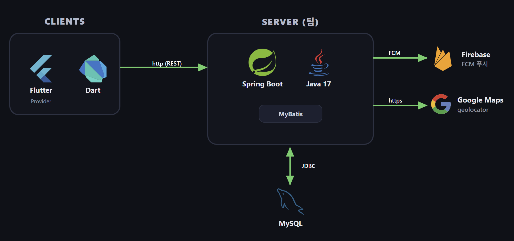

<h1 align="center">🍕 PizzaEatHo — 피자 주문 · 커스터마이징 앱</h1>

<p align="center">
  도우 · 크러스트 · 토핑을 직접 골라 <b>나만의 피자</b>를 주문하는 모바일 앱<br/>
  <em>Flutter 모바일 앱 + Spring Boot REST API 풀스택 프로젝트 (프론트엔드 담당)</em>
</p>

<p align="center">
  
  
  
  
</p>

---

## 📌 프로젝트 개요

| 항목 | 내용 |
|:---:|---|
| **기간** | 2025.11 ~ 2025.12 |
| **형태** | 팀 프로젝트 (2인) · SSAFY 첫 프로젝트 |
| **담당** | **프론트엔드 (Flutter)** — 앱 화면 · 상태관리 · API 연동 |
| **한줄 소개** | 토핑/도우/크러스트 조합으로 피자를 커스터마이징해 주문하는 모바일 주문 앱 |

---

## 🛠️ 기술 스택

| 분류 | 기술 |
|:---:|---|
| **Framework** | Flutter · Dart 3.10 |
| **상태관리** | Provider |
| **네트워크 / 저장** | http · shared_preferences |
| **지도 / 위치** | google_maps_flutter · geolocator |
| **알림** | Firebase Cloud Messaging |
| **Backend(협업)** | Spring Boot · MyBatis · MySQL |

---

## 🏗️ 아키텍처



---

## ✨ 핵심 기능 (프론트 구현)

### 1. 피자 커스터마이징 주문 UI
- 상품 · 도우 · 크러스트 · 토핑을 선택해 주문을 구성하는 화면
- 선택에 따른 가격 계산 및 주문 요약

### 2. 주문 조회 & 푸시 알림
- 주문 내역/상태 조회 화면
- 주문 상태 변경 시 FCM 푸시 알림 수신

### 3. 지도 · 위치
- google_maps_flutter / geolocator로 매장·위치 표시

### 4. 리뷰
- 제품 리뷰 작성 및 조회 화면

---

## 📂 프로젝트 구조

```
pizza_eat_ho/lib/
├── data/   # API 연동 · 모델
├── ui/     # 화면(위젯)
├── util/   # 공통 유틸
└── main.dart
```

---

## 🚀 실행 방법

```bash
cd pizzaeatho/pizza_eat_ho
flutter pub get
flutter run
```

---

> 📎 SSAFY 첫 프로젝트로 진행한 풀스택 학습 프로젝트입니다. 저는 **프론트엔드(Flutter)** 를 담당해 주문 커스터마이징 UI와 상태관리, REST API 연동을 구현했습니다.
